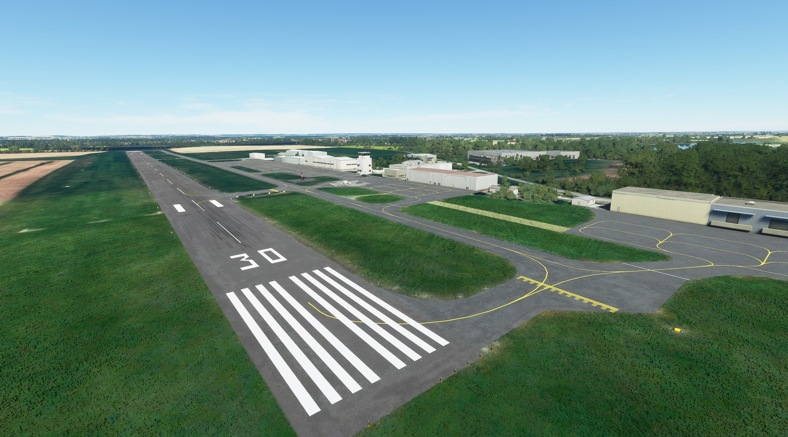

# LFBR - Muret Lherm [EN]

Microsoft Flight Simulator scenery fix

## Description
This scenery fix number of autogen error for the Muret Lherm airfield.
- Fix runway
- Fix taxiway
- Fix parking
- Fix holding points
- Fix PAPI slope
- Fix lightning 
- Fix vegetation

No custom building.

# LFBR - Muret Lherm [FR]

Correction de scène Microsoft Flight Simulator

## Description

Cette scène corrige un certain nombre d'erreur de l'autogen sur l'aérodrome de Muret Lherm.

- Correction des pistes
- Correction des taxiway
- Correction des parking
- Correction des point d'arrêt
- Correction des pente PAPI
- Correction des éclairages
- Correction de la végétation

Ne comprend pas de bâtiment personnalisé.

